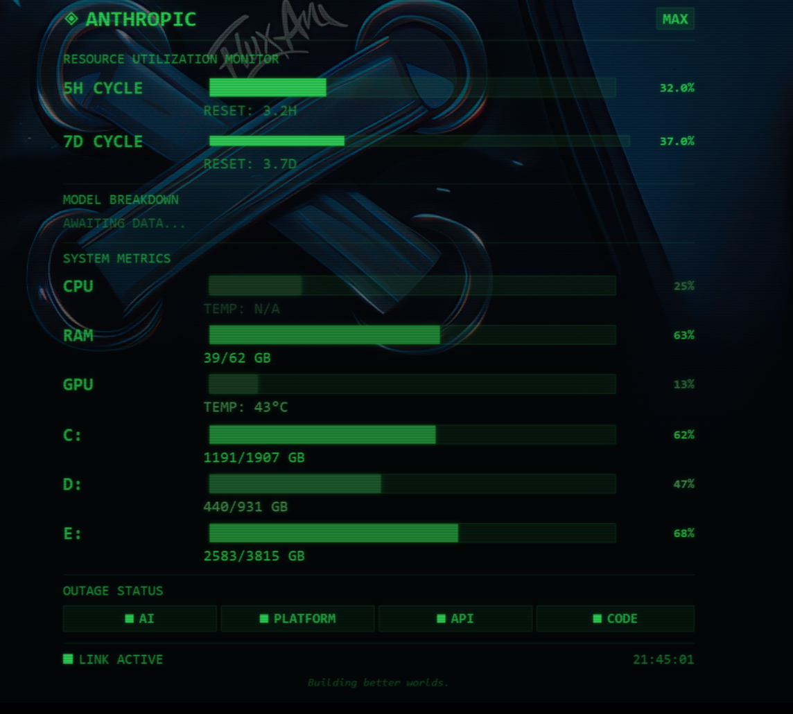

# ANTHROPIC RESOURCE UTILIZATION MONITOR

> A retro-terminal themed desktop widget for Windows that monitors your Claude AI usage, system resources, and Anthropic service status in real time.



## Features

- **Claude Usage Tracking** -- Live 5-hour and 7-day utilization cycles with countdown timers to reset
- **System Metrics** -- CPU, RAM, and GPU utilization bars with temperature readouts (NVIDIA GPU via `nvidia-smi`)
- **Outage Detection** -- Four status indicators polling `status.claude.com`: AI, Platform, API, and Claude Code
- **Sound Alert** -- Plays an audio alert when a service transitions from operational to degraded or outage
- **Retro Terminal Aesthetic** -- Phosphor-green-on-black CRT look with scanline overlay and Consolas font
- **Always-on-Desktop** -- Transparent, borderless WPF window; draggable and resizable
- **Settings Persistence** -- Window position, size, and lock state saved to a local JSON file
- **Subscription-Aware** -- Displays your plan tier (MAX / PRO / TEAM) in the header badge
- **Companion Popup** -- Includes a lightweight one-shot script (`usage.ps1`) for quick checks or Stream Deck integration

## Prerequisites

| Requirement | Details |
|---|---|
| **OS** | Windows 10 / 11 |
| **PowerShell** | 5.1+ (ships with Windows) |
| **Claude Subscription** | Claude Max or Claude Pro (active) |
| **Claude Code CLI** | Must be installed and authenticated at least once -- the widget reads OAuth credentials from `~/.claude/.credentials.json` |
| **NVIDIA GPU** *(optional)* | `nvidia-smi` must be on PATH for GPU metrics; non-NVIDIA systems gracefully show `N/A` |

## Installation

```powershell
# 1. Clone the repo
git clone https://github.com/Aragorn2046/claude-usage-widget.git
cd claude-usage-widget

# 2. Make sure you've authenticated Claude Code at least once
claude  # follow the OAuth login flow if prompted

# 3. Launch the widget
powershell -ExecutionPolicy Bypass -File windows\usage-widget.ps1
```

To run it hidden (no PowerShell console window):

```
powershell.exe -WindowStyle Hidden -ExecutionPolicy Bypass -File "C:\path\to\windows\usage-widget.ps1"
```

### Quick-Check Popup (Stream Deck / hotkey)

The companion script shows a small popup with your current usage and auto-closes after 10 seconds:

```
powershell.exe -WindowStyle Hidden -ExecutionPolicy Bypass -File "C:\path\to\windows\usage.ps1"
```

## Controls

| Action | Input |
|---|---|
| **Move** | Left-click drag (when unlocked) |
| **Resize** | Drag the grip in the bottom-right corner (when unlocked) |
| **Context Menu** | Right-click anywhere |
| **Lock / Unlock** | Context menu > LOCK / UNLOCK |
| **Force Refresh** | Context menu > REFRESH |
| **Relink** | Context menu > RELINK -- force re-read of credentials and trigger a fresh API call |
| **Restart** | Context menu > RESTART -- relaunch the widget process without manually closing and reopening |
| **Close** | Context menu > CLOSE, or press `ESC` |

Content scales proportionally via a WPF `ViewBox`, so the layout stays readable at any size.

### Outage Alert Sound

Place a file named `outage-alert.mp3` in the `windows/` directory. The alert plays once when any service transitions from operational to a degraded or outage state. Remove the file to disable alerts.

## How It Works

### Authentication

The widget is **read-only** -- it reads the OAuth credentials that the [Claude Code CLI](https://docs.anthropic.com/en/docs/claude-code) stores at `%USERPROFILE%\.claude\.credentials.json` but **never modifies or refreshes tokens**. This prevents the widget from invalidating tokens used by active Claude Code sessions (OAuth token rotation means refreshing a token invalidates the previous one).

If the token expires or becomes invalid, the widget shows `NEEDS LOGIN` -- simply run `claude` in your terminal to re-authenticate, then click RELINK in the widget's context menu.

**Important:** The usage API requires the `anthropic-beta: oauth-2025-04-20` header. Without it, OAuth tokens are rejected with a 401 error.

**No API keys are needed. No separate login flow. No credentials are stored or modified by this widget.**

### API Endpoints

| Endpoint | Purpose | Interval |
|---|---|---|
| `api.anthropic.com/api/oauth/usage` | 5-hour and 7-day utilization data | 180 s (3 min) |
| `status.claude.com/api/v2/components.json` | Service outage status for 4 components | 180 s (3 min) |

> **Note:** The usage API has aggressive rate limiting. Do **not** reduce the poll interval below 120 seconds or you will hit 429 errors. During development/debugging, avoid making rapid manual API calls -- even 10-15 calls in a short window can trigger rate limiting that persists for 10+ minutes.

### System Metrics

Local system data is collected every 10 seconds:

- **CPU** -- `Win32_Processor` (WMI) for load; performance counters for temperature
- **RAM** -- `Win32_OperatingSystem` for total and free memory
- **GPU** -- `nvidia-smi` for utilization and temperature

### Color Coding

| Range | Color |
|---|---|
| < 50% / < 60 C | Green |
| 50-79% / 60-80 C | Amber |
| >= 80% / > 80 C | Red |

## WSL Users

If you run Claude Code in WSL, credentials live at `~/.claude/.credentials.json` inside WSL rather than on the Windows side. The widget **automatically syncs** WSL credentials to Windows -- it detects your WSL distro and copies the credentials file via `\\wsl.localhost\<distro>\` whenever the WSL copy is newer.

No manual sync script is needed. If auto-sync doesn't work (e.g., WSL not running), you can manually copy:

```powershell
Copy-Item "\\wsl.localhost\Ubuntu-24.04\home\$($env:USERNAME.ToLower())\.claude\.credentials.json" "$env:USERPROFILE\.claude\.credentials.json"
```

## Project Structure

```
claude-usage-widget/
  windows/
    usage-widget.ps1           # Desktop widget (main script)
    usage.ps1                  # One-shot popup (Stream Deck / hotkey)
    outage-alert.mp3           # Alert sound (played on outage detection)
  streamdeck/
    usage-monitor.ps1          # Headless daemon for Stream Deck text files
  sync-credentials.sh          # WSL-to-Windows credential sync
  instructions.html            # Legacy setup guide
```

## License

MIT License. See [LICENSE](LICENSE) for details.

## Credits

Built by [ItsMrMetaverse](https://github.com/Aragorn2046), [Yahiya Jasem](https://github.com/yahiya), and [Claude Code](https://claude.ai/claude-code) (Anthropic).

Powered by the [Claude Code CLI](https://docs.anthropic.com/en/docs/claude-code) OAuth API.

*"Building better worlds."*
